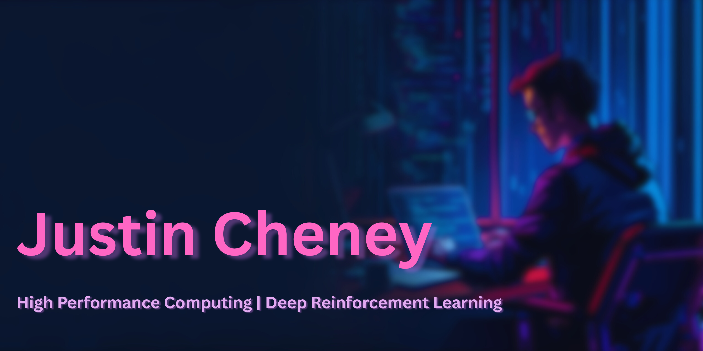

<!-- Header Image/Banner -->

  
# Hi there, I'm Justin Cheney 👋
  

  

  

---

## 🙋‍♂️ Personal Introduction

Hello! I'm **Justin Cheney**, a Computer Science Honours student at the University of the Western Cape, Cape Town, South Africa. I'm actively engaged in multiple research and infrastructure roles spanning bioinformatics workflows, high-performance computing infrastructure, and nature-inspired AI research. My career goal is to advance **High-Performance Computing (HPC)** and **computational biology** by developing intelligent systems that optimize resource allocation, enable reproducible workflows, and democratize access to computational infrastructure across African institutions.

Currently, I'm working on:
- **Bioinformatics Workflows & SOP Development** at SANBI as part of the PHA4GE consortium, designing standardized bioinformatic workflows for epidemiologists
- **HPC Infrastructure & GPU Configuration** as a Research Assistant for the SI-NRF Centre of Excellence in Food Security
- **Nature-Inspired AI Research** with the Computational Intelligence Research Group (CIRG) across agri-food systems, smart healthcare, and resource optimization
- **HPC Education & Documentation** as Co-Lead Mentor at UWC for the CSIR CHPC Student Cluster Competition

My work focuses on the intersection of:

- **🖥️ High-Performance Computing (HPC)**: Optimizing cluster infrastructure, GPU configuration, and parallel computing for scientific research at scale
- **🧬 Bioinformatics & Workflows**: Designing reproducible, standardized computational workflows for epidemiological research and pathogen analysis
- **🤖 Nature-Inspired AI & Deep Reinforcement Learning**: Developing intelligent systems for resource optimization, job scheduling, and problem-solving across diverse domains
- **💎 Julia Programming**: Harnessing Julia's power for scientific computing and performance-critical applications
- **📚 HPC Education**: Creating accessible documentation and mentorship pathways for the next generation of HPC practitioners

---

## 💼 Work Experience

### **HPC/Infrastructure Engineer Intern**
**South African National Bioinformatics Institute (SANBI)** | *Cape Town, South Africa*  
📅 *Present*

Working across multiple strategic initiatives in the HPC and bioinformatics departments:

**HTC Workflows & SOP Development (PHA4GE Project):**
- 🧬 Designing standardized bioinformatic workflows and Standard Operating Procedures (SOPs) for pathogen genomics
- 🌍 Developing workflows intended for implementation across epidemiology labs and institutions in Africa
- 📋 Creating reproducible, containerized workflows for high-throughput computational analysis
- 🤝 Collaborating with PHA4GE consortium partners to ensure interoperability and accessibility

**HPC Infrastructure Management:**
- 🖥️ Managing and maintaining HPC cluster infrastructure for computational biology research
- 🌐 Network administration and optimization for high-throughput data transfer
- 📊 Performance monitoring and system optimization using tools like Prometheus and Grafana
- 🔧 Supporting researchers with job scheduling, resource allocation, and computational workflow optimization
- 🛠️ Troubleshooting and resolving technical issues in a production HPC environment
- 📈 Contributing to infrastructure upgrades and capacity planning

**Technologies Used:** Slurm, Linux (Ubuntu), Singularity/Docker, Nextflow, CWL, Networking protocols, Monitoring tools, HPC optimization techniques

### **Research Assistant (Infrastructure & Innovation)**
**SI-NRF Centre of Excellence in Food Security** | *South Africa*  
📅 *Present*

Supporting cutting-edge research in food security through high-performance computing infrastructure.

**Key Responsibilities & Achievements:**
- 🖥️ HPC cluster configuration and management for food security research initiatives
- 🎮 GPU acquisition, installation, and optimization for accelerated computing workloads
- 🔧 System administration and environment optimization for diverse researcher needs
- 📚 Creating user-friendly documentation and training materials for HPC cluster access
- 🌐 Designing accessible computational environments for researchers with varying technical backgrounds
- 🚀 Performance tuning and resource allocation optimization
- 🔬 Supporting researchers in utilizing advanced computing resources for their work

**Technologies Used:** Linux systems administration, GPU computing (CUDA), HPC cluster management, Documentation tools

### **Research Collaborator**
**Computational Intelligence Research Group (CIRG)** | *South Africa*  
📅 *Present*

Conducting research on nature-inspired AI techniques and their applications across multiple domains.

**Technologies Used:** Nature-inspired algorithms, Machine Learning, Python, Data analysis tools

### **Co-Lead Mentor (Volunteer)**
**CSIR CHPC Student Cluster Competition - University of the Western Cape** | *Cape Town, South Africa*  
📅 *2025 - Present* (Continuing from 2024)

Volunteering as Co-Lead Mentor to develop the next generation of HPC practitioners at UWC, with a focus on training mentors and equipping competition participants.

**Key Responsibilities & Achievements:**
- 👥 Leading UWC team through the CSIR CHPC Student Cluster Competition pipeline
- 🎓 Training and developing the next generation of mentors - equipping them with HPC knowledge and mentorship skills
- 📚 Teaching participants from Linux fundamentals through to advanced benchmarking and performance optimization
- 💻 Curriculum development: Linux basics → cluster architecture → optimization → benchmarking → performance analysis
- 📖 Creating accessible educational resources and documentation for skill progression
- 📝 Planning and executing a publication on HPC Education (2026/2027) to share best practices
- 🏆 Guiding teams to national competition success while building a sustainable mentorship pipeline

**Impact:** Trained 2025 team member selected for the National Team; establishing long-term HPC education culture at UWC

**Technologies Used:** Linux, HPC Architecture, Benchmarking tools, Technical writing, Mentorship frameworks

---

## 🎓 Education

### **BSc Computer Science (Honours)** 
**University of the Western Cape** | *Cape Town, South Africa*  
📅 *2026 - Present*

### **BSc Computer Science**
**University of the Western Cape** | *Cape Town, South Africa*  
📅 *2023 - 2025*

---

## 🛠️ Skills & Interests

### Technical Skills

#### Programming Languages

  

#### Frameworks & Libraries

#### Development Tools & Technologies

  

### Soft Skills

<table align="center">
  <tr>
    <td align="center">💡 <strong>Problem Solving</strong></td>
    <td align="center">🤝 <strong>Team Collaboration</strong></td>
    <td align="center">📊 <strong>Research & Analysis</strong></td>
  </tr>
  <tr>
    <td align="center">🎯 <strong>Critical Thinking</strong></td>
    <td align="center">📚 <strong>Self-Learning</strong></td>
    <td align="center">⏱️ <strong>Time Management</strong></td>
  </tr>
  <tr>
    <td align="center">📝 <strong>Technical Writing</strong></td>
    <td align="center">🗣️ <strong>Communication</strong></td>
    <td align="center">🔍 <strong>Attention to Detail</strong></td>
  </tr>
</table>

### Academic & Professional Interests

- 🌱 Exploring advanced parallel computing patterns in Julia
- 🎯 Implementing state-of-the-art Deep RL algorithms for HPC job scheduling
- 💡 Optimizing neural network training on distributed systems
- 📚 Contributing to open-source HPC and Julia ecosystem
- 🔬 Resource allocation and optimization in high-performance computing environments
- 🧠 Model-based reinforcement learning systems
- ⚡ Performance optimization and benchmarking

---

## 🚀 Projects & Competitions

<table>
  <tr>
    <td width="50%">
      <h3 align="center">🔍 Just-in-Check</h3>
      

        <!--  -->
        

          
          
        

        
<strong>Technologies:</strong> C, Adversarial Algorithms

        
<strong>Description:</strong> A chess engine written in C following bluefeversoft's tutorial. This project enhanced my understanding of AI heuristics for move calculation and applied advanced C programming techniques learned during my third year.

        
<strong>Role:</strong> Solo Developer

        
<strong>Outcome:</strong> Functional chess engine with AI opponent capabilities

      

    </td>
    <td width="50%">
      <h3 align="center">📊 DRL Job Scheduling</h3>
      

        <!--  -->
        

          
          
        

        
<strong>Technologies:</strong> Python, Gymnasium, PyTorch, stable-baseline3, SnakeMake

        
<strong>Description:</strong> A framework and statistcal analysis of three major DRL algorthim families to see which performs Pareto optimally within the HPC Job Scheduling environment

        
<strong>Role:</strong> Researcher

        
<strong>Outcome:</strong> Imperative Statistical Analysis of DRL algorithms in the Job Scheduling Environment

      

    </td>
  </tr>
</table>

### 🏆 Competitions & Hackathons

<table>
  <tr>
    <td width="50%">
      <h4>🥉 CSIR CHPC Student Cluster Competition 2024</h4>
      
<strong>Role:</strong> Team Lead

      
<strong>Achievement:</strong> 3rd Place (National Round)

      
<strong>Description:</strong> Led a team in building and optimizing a small HPC cluster over 5 intensive days. Responsible for fine-tuning cluster performance and running various synthetic and application-based benchmarks to demonstrate system capabilities.

      
<strong>Skills Applied:</strong> HPC Architecture, Performance Benchmarking, Team Leadership, Cluster Optimization

    </td>
    <td width="50%">
      <h4>🎓 CSIR CHPC Student Cluster Competition 2025</h4>
      
<strong>Role:</strong> Lead Mentor

      
<strong>Achievement:</strong> Mentored team to 4th Place (National Round)

      
<strong>Description:</strong> Served as lead mentor, training students from preparation through to the national competition round. Personally mentored the 4th place team, with one team member being selected for the National Team - a testament to the quality of training and guidance provided.

      
<strong>Skills Applied:</strong> Mentorship, Technical Training, HPC Education, Leadership Development

    </td>
  </tr>
</table>

---

## 📄 Publications

**No publications yet.**

*Currently working on research in HPC job scheduling optimization using deep reinforcement learning. Stay tuned for upcoming papers!*

---

## 🤝 Affiliations & Memberships

### Professional Organizations

- 💻 **Open Source Contributor** - Julia Community & HPC Ecosystem

### University Clubs & Societies

- 🎓 **IT Society** - (Member) University of the Western Cape
- 📚 **HPC Society** - (Mentor) University of the Western Cape

---

## 📊 GitHub Statistics

---

## 💭 Random Dev Quote

---

## 📫 Contact Information

### Let's Connect! 🌐

<!--  -->

### 📍 Location
**Cape Town, South Africa** 🇿🇦

---

### ⚡ Fun Facts About Me

💻 I code best with a cup of coffee ☕ | ♟️ When not coding, you'll find me playing chess | 🌍 Love exploring new technologies

---

### 💡 *"High performance isn't just about speed, it's about efficiency, scalability, and elegance."*

---

**Thanks for visiting my profile!** ⭐  
*Feel free to reach out if you want to collaborate on HPC, Julia, or RL projects!*

